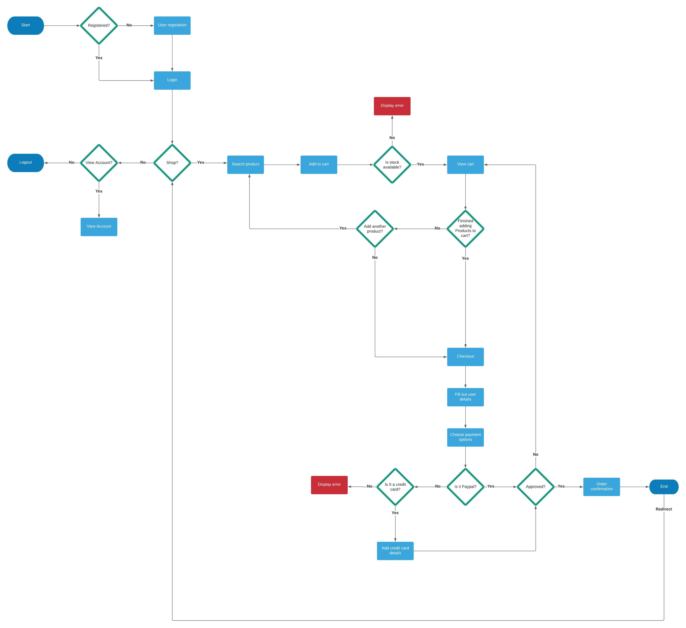
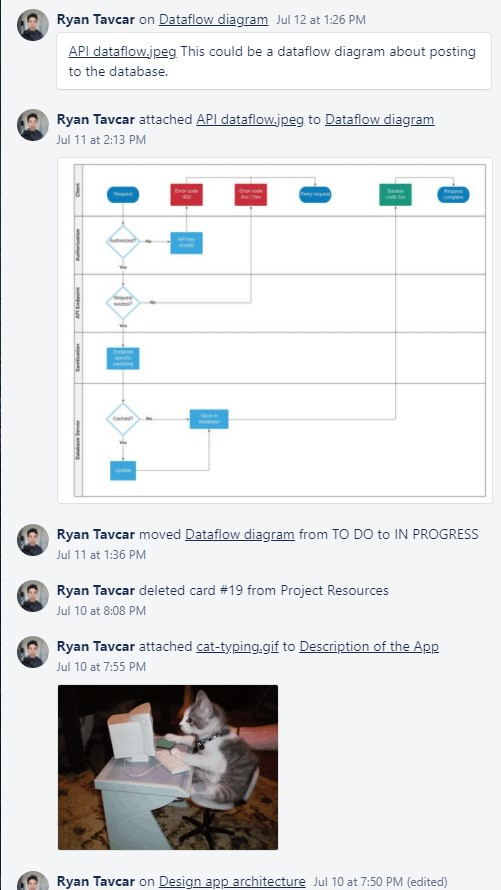

MERN stack e-commerce Website created by **Irah Rosete** & **Ryan Tavcar**

### Crumple Repository
https://github.com/Crumple-au/Crumple

Welcome to  Crumple readme. To discover about the purpose of Crumple, it's functionality and all its features, our target audience and the tech stack used,screenshots of our wireframes and project management; continue reading through the Readme.

## Table of Contents
- [Purpose of the Application](#purpose-of-the-application)
- [Functionality / Features](#functionality---features)
- [Target Audience](#target-audience)
- [Tech Stack](#tech-stack)
- [Dataflow Diagrams](#dataflow-diagrams)
- [Application Architecture](#application-architecture)
- [User Stories](#user-stories)
- [Wireframes](#wireframes)
- [Trello Board Screenshots](#trello-board-screenshots)

Purpose of the Application
=================================================================================================

### Find Out Who We Are

Crumple is a global online marketplace, where people come together to make, sell, buy and collect unique visual artworks from incredible artists. We are also a community pushing for positive change for small businesses, artists and the planet.

### Support Indie Creators

These is no Crumple warehouse or factory - Only millions of artists selling their creations. We make the entire process simple by assisting you in directly connecting with creators in order to unearth something exceptional.

Functionality / Features
=================================================================================================

### Minimum Viable Product
- **User Authentication**

    User authentication is a process that allows a device to verify the identify of someone who connects to our server. Crumple will utilize authentication by verifing the users email and password to prove users who they say they are.

- **Search and Filter**

    Crumple will have a search and filter functionality in order to sift through artworks that are for sale. Crumple will organize the filter functionality by drawing & painting, design & tech, merchandise, books & writing, photography, film & video, music & sound design and craft & DIY. Upon selecting a category, the user will be taken to a 'discover' page that will list all the available artworks to be bought with accompanying details per artwork. More information about the artwork can be discovered by selecting individual artwork, with such information as price, quantity, image, description and artist.

- **Buy / Sell Artworks**

    Artist / buyers will be able to log in and buy and sell artwork. In a buyer scenario, a user will select the artwork to purchase by adding it to a cart. The two methods of payment are paypal and credit / debit cards via Stripe. Stripe is a service that offers payment processing interfaces for e-commerce websites and mobile applications.

    In a seller scenario, An artist is able to log in, navigate to the sell artwork page and fill out a form that will take an image, description, price and quantity (at a minimum) and upload their artwork to be viewed and sold via Crumple.

- **Cart of Orders**

    Crumple will have a shopping cart feature. it accepts the customers payment and organizes the distribution of that information to the seller, payment processor and other parites. The shopping cart feature will add a more pleasant user experience by allowing to user to shop and buy more seamlessly.

### Extras

- **Direct Messages**

    Crumple will include a direct message feature that will allow buyers to interact and ask questions directly to the seller. The chat system will be end-to-end encryption, which will make the buyer and sellers' converstations to be private by encryting and decyrpting the text messages on the client side.

Target Audience
=================================================================================================

Through a thorough analze of the market, Crumple has determined that the best audience for our seller to buyer applicaiton, resides inearly twenty to mid thirty year olds, with an expandable income. The Crumple team agrees that many users will register with us to find unique artworks to decorate their homes and to express themselves.

Tech Stack
=================================================================================================

- **MongoDB**

    We chose to utilise MongoDB because we wanted a nosql database for simplicity and for its great user experience for developers. Prior to MongoDB, our team were only familiar with Postgresql, a change in database came from wanting to expand our knowledge of databases and bolster our portfolio.

    https://www.mongodb.com

- **Express JS**

    Express was chosen as our backend framework as it is often the most popular, and documented framework (in comparsion to hapi or fastify) it is also prebuilt into NodeJS and is simple and scalable.

    https://expressjs.com

- **React JS**

    React is the frontend library that was used in Crumple. it is very popular, fast and simple, it is also the frontend library that our team is most confortable and knowledgeable with. it is also a requirment in our assesment to use react. 

    https://reactjs.org

- **Node JS**

    Node.js is a cross-platform, back-end Javascript runtime enviroment that always us to execute Javascript code outside of the browser.
    
    https://nodejs.org/en/

- **Redux**

    We have a few complex dataflow structures in Crumple, for example, a users cart page which holds the uses cart items before checkout. Alot of pages are using the same data, intead of prop drilling or using React useContext / useReducer, we opted for the more industry wanted tool. Redux.

    https://redux.js.org

## Dependencies Used

### Dependencies

- Axios
- Bcrypt
- Dotenv
- Js-cookie
- JsonWebTokens
- Mongoose
- Stripe

### Developer Dependencies

- Nodemon

Dataflow Diagrams
=================================================================================================

### Crumple Workflow Detailed

### PUT Request to Mongodb Dataflow

### Crumple Workflow Broad

Application Architecture
=================================================================================================

### App Architecture

### Folder Structure
 

User Stories
=================================================================================================

### **As a buyer**

I want to see all categories
So that I can browse and know what is offered

### **As a buyer**

I want to be able to search and filter products
So that I can limit results

### **As a buyer**

I want to know more about a product
So that I can decide whether or not to purchase

### **As a buyer**

I want to be able to check a seller's page
So that I can see all the products they offer

### **As a buyer**

I want to be able to use PayPal or credit card to checkout
So that I can purchase products

### **As a buyer**

I want to be able to add multiple items in my cart
So that I can pay all at once

### **As a buyer**

I want to be able to buy as guest user
So that I won't have to create an account

### **As a buyer**

I want to receive confirmation of my purchase
So that I have proof

### **As a buyer**

I want to be able to sort products according to price
So that I can make better decision on my purchase

### **As a user**

I want access to an FAQ page
So that I can search answers to my questions

### **As a seller**

I want to be able to sign up
So that I can use the app

### **As a seller**

I want to be able to sign in
So that I can create my profile page

### **As a seller**

I want to be able to log out
So that I leave the app securely

### **As a seller**

I want access to my profile page
So that I can edit it

### **As a seller**

I want to be able to add products and their descriptions and prices
So that I am able to sell them

### **As a seller**

I want to be able to save my bank details securely
So that I can receive payments

### **As a seller**

I want to have access to all the products I've added
So that I can manage them

Wireframes
=================================================================================================

## **Desktop**

- ### Homepage
    

- ### Individual product page
    

- ### Create new product page
    

## **Tablet**

- ### Homepage with navbar activated

    

- ### User settings page

    

- ### Create user profile page

    

## **Mobile**

- ### Homepage with navbar activated

    

- ### Individual product page

    

### View Wireframe **Prototype**
https://www.figma.com/proto/b4VQn9HVOVOB9eSXYvQ0BH/Crumple?node-id=3%3A5&scaling=scale-down&page-id=0%3A1&starting-point-node-id=3%3A5

### View All Wireframes

https://www.figma.com/file/b4VQn9HVOVOB9eSXYvQ0BH/Crumple?node-id=0%3A1

Trello Board Screenshots
=================================================================================================

## **Trello Dashboard Progression**

## **Labels**

## **Irah's Activity**

## **Ryan's Activity**

