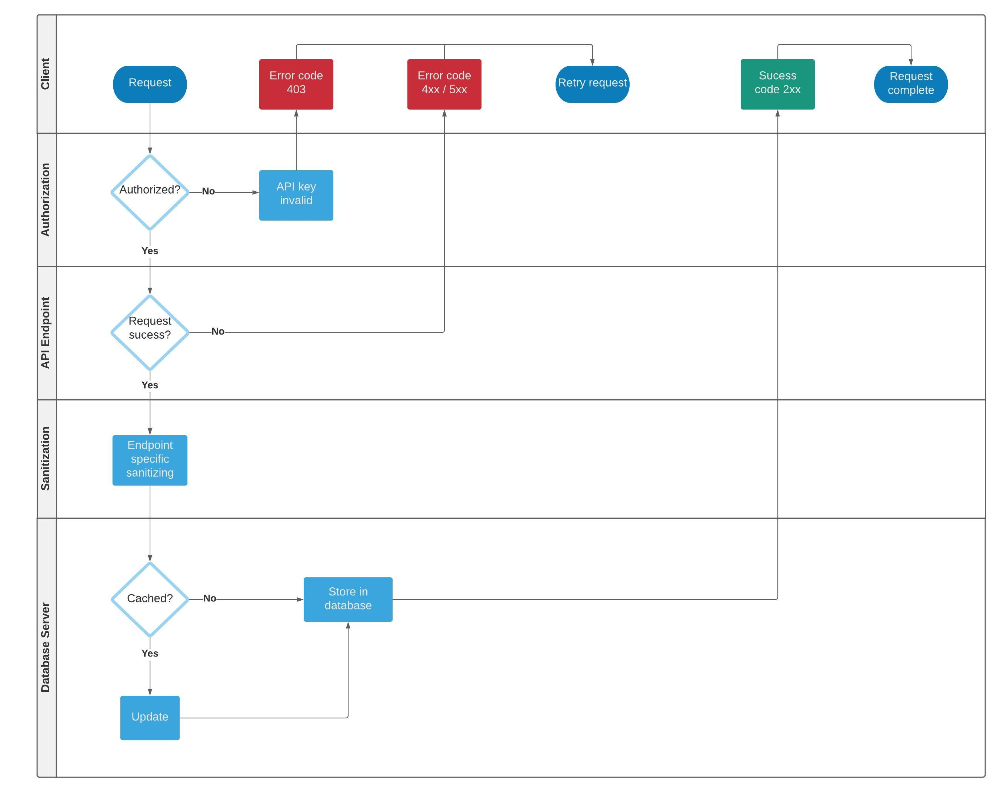
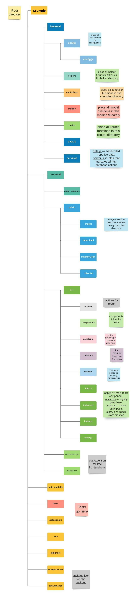
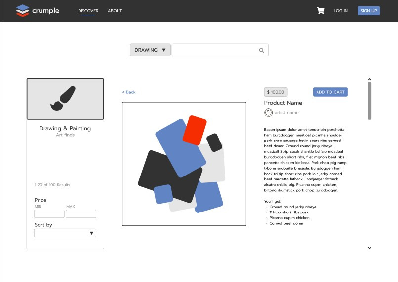

#  crumple

MERN stack e-commerce website created by **Irah Rosete** & **Ryan Tavcar**

**Live Site**: https://crumple.netlify.app/  
**Git Repository**: https://github.com/Crumple-au/Crumple

Welcome to Crumple readme. To discover about the purpose of Crumple, it's functionality and all its features, our target audience and the tech stack used,screenshots of our wireframes and project management; continue reading through the Readme.

## Table of Contents

- [Purpose of the Application](#purpose-of-the-application)
- [Functionality / Features](#functionality---features)
- [Target Audience](#target-audience)
- [Tech Stack](#tech-stack)
- [Dataflow Diagrams](#dataflow-diagrams)
- [Application Architecture](#application-architecture)
- [User Stories](#user-stories)
- [Wireframes](#wireframes)
- [Trello Board Screenshots](#trello-board-screenshots)
- [Testing](#testing)
- [Deployment](#deployment)
- [How to run Locally](#how-to-run-locally)
- [Known Issues You May Encounter](#known-issues-you-may-encounter)

# Purpose of the Application

### Find Out Who We Are

Crumple is a global online marketplace, where people come together to make, sell, buy and collect unique visual artworks from incredible artists. We are also a community pushing for positive change for small businesses, artists and the planet.

### Support Indie Creators

These is no Crumple warehouse or factory - Only millions of artists selling their creations. We make the entire process simple by assisting you in directly connecting with creators in order to unearth something exceptional.

# Functionality / Features

### Minimum Viable Product

- **User Authentication**

  User authentication is a process that allows a device to verify the identify of someone who connects to our server. Crumple will utilize authentication by verifing the users email and password to prove users who they say they are.

- **Search and Filter**

  Crumple will have a search and filter functionality in order to sift through artworks that are for sale. Crumple will organize the filter functionality by drawing & painting, design & tech, merchandise, books & writing, photography, film & video, music & sound design and craft & DIY. Upon selecting a category, the user will be taken to a 'discover' page that will list all the available artworks to be bought with accompanying details per artwork. More information about the artwork can be discovered by selecting individual artwork, with such information as price, quantity, image, description and artist.

- **Buy / Sell Artworks**

  Artist / buyers will be able to log in and buy and sell artwork. In a buyer scenario, a user will select the artwork to purchase by adding it to a cart. The two methods of payment are paypal and credit / debit cards via Stripe. Stripe is a service that offers payment processing interfaces for e-commerce websites and mobile applications.

  In a seller scenario, An artist is able to log in, navigate to the sell artwork page and fill out a form that will take an image, description, price and quantity (at a minimum) and upload their artwork to be viewed and sold via Crumple.

- **Cart of Orders**

  Crumple will have a shopping cart feature. it accepts the customers payment and organizes the distribution of that information to the seller, payment processor and other parites. The shopping cart feature will add a more pleasant user experience by allowing to user to shop and buy more seamlessly.

### Extras

- **Direct Messages**

  Crumple will include a direct message feature that will allow buyers to interact and ask questions directly to the seller. The chat system will be end-to-end encryption, which will make the buyer and sellers' converstations to be private by encryting and decyrpting the text messages on the client side.

# Target Audience

Through a thorough analze of the market, Crumple has determined that the best audience for our seller to buyer applicaiton, resides inearly twenty to mid thirty year olds, with an expandable income. The Crumple team agrees that many users will register with us to find unique artworks to decorate their homes and to express themselves.

# Tech Stack

- **MongoDB**

  We chose to utilise MongoDB because we wanted a nosql database for simplicity and for its great user experience for developers. Prior to MongoDB, our team were only familiar with Postgresql, a change in database came from wanting to expand our knowledge of databases and bolster our portfolio.

  https://www.mongodb.com

- **Express JS**

  Express was chosen as our backend framework as it is often the most popular, and documented framework (in comparsion to hapi or fastify) it is also prebuilt into NodeJS and is simple and scalable.

  https://expressjs.com

- **React JS**

  React is the frontend library that was used in Crumple. it is very popular, fast and simple, it is also the frontend library that our team is most confortable and knowledgeable with. it is also a requirment in our assesment to use react.

  https://reactjs.org

- **Node JS**

  Node.js is a cross-platform, back-end Javascript runtime enviroment that always us to execute Javascript code outside of the browser.

  https://nodejs.org/en/

- **Redux**

  We have a few complex dataflow structures in Crumple, for example, a users cart page which holds the uses cart items before checkout. Alot of pages are using the same data, intead of prop drilling or using React useContext / useReducer, we opted for the more industry wanted tool. Redux.

  https://redux.js.org

## Dependencies Used

### Dependencies

- Axios

  https://www.npmjs.com/package/axios

  Axios is a promise based HTTP client for the browser and Node. js. Axios makes it easy to send asynchronous HTTP requests to REST endpoints and perform CRUD operations.

- Bcrypt

  https://www.npmjs.com/package/bcryptjs

  The bcrypt library on NPM makes it really easy to hash and compare passwords in Node. Bcrypt is the de facto way to hash and store passwords.

- Dotenv

  https://www.npmjs.com/package/dotenv

  Dotenv is a zero-dependency module that loads environment variables from a . env file into process.

- JsonWebTokens

  https://www.npmjs.com/package/jsonwebtoken

  JWT specifies a compact and self-contained method for communicating information as a JSON object between two parties. **Crumple** utilised jsonWebTokens as middlewear to our routes. check out backend/Util/util.js.

- Mongoose

  https://www.npmjs.com/package/mongoose

  Mongoose is an Object Data Modeling (ODM) library for MongoDB and Node. js. It manages relationships between data, provides schema validation, and is used to translate between objects in code and the representation of those objects in MongoDB.

- Material UI

  https://material-ui.com/

  Material UI is a component library for React that provides pre-styled components. It is simple to implement and helps prevent inconsistencies in styling. Material UI is used throughout the components of the application to provide a uniform feel in the UI. You can see this in the buttons, for example.

- React Redux

  https://www.npmjs.com/package/react-redux

  Redux is a predictable state container for JavaScript apps. It helps you write applications that behave consistently, run in different environments (client, server, and native). **Crumple** used redux all over our app, as we are constantly retrieve data to utilise it.

- Paypal Rest SDK

  https://www.npmjs.com/package/paypal-rest-sdk

  To simplify integrations, PayPal provides REST server SDKs for these languages in these GitHub repositories. For mobile integrations, contact your PayPal account manager. Each repository includes integration and configuration information and samples.

- AWS SDK

  https://www.npmjs.com/package/aws-sdk

  To simplify integrations, PayPal provides REST server SDKs for these languages in these GitHub repositories. For mobile integrations, contact your PayPal account manager. Each repository includes integration and configuration information and samples. **Crumple** used this library to upload and retrieve images from our s3 bucket.

- Redux-Thunk

  https://www.npmjs.com/package/redux-thunk

  Redux Thunk middleware allows you to write action creators that return a function instead of an action. The thunk can be used to delay the dispatch of an action, or to dispatch only if a certain condition is met. The inner function receives the store methods dispatch and getState as parameters. Checkout frontend/actions/userActions (artworkActions, orderActions will do as well), these functions retrieve user information from getState() to then send their token to the backend to then verify the user.

- React-Easy-Crop

  https://www.npmjs.com/package/react-easy-crop

  A React component to crop images/videos with easy interactions. You will find that /frontend//src/utils/cropImage and /frontend//src/componenents/uploadModal is where all this code lies. What was difficult about this library is the lack of information/documentation out there.

### Developer Dependencies

- Nodemon

  https://www.npmjs.com/package/nodemon

  nodemon is a tool that helps develop node.js based applications by automatically restarting the node application when file changes in the directory are detected

- Jest

  https://jestjs.io/

  Jest is a JavaScript testing framework designed to ensure correctness of any JavaScript codebase. It allows writing tests with an approachable, familiar and feature-rich API that gives results quickly.

- Enzyme

  https://enzymejs.github.io/enzyme/

  Enzyme is a JavaScript Testing utility for React that makes it easier to test React Components' output. Enzyme's API is meant to be intuitive and flexible by mimicking jQuery's API for DOM manipulation and traversal.

- React Testing Library

  https://testing-library.com/docs/react-testing-library/intro/

  The React Testing Library is a very light-weight solution for testing React components. It provides light utility functions on top of react-dom and react-dom/test-utils, in a way that encourages better testing practices. It tests how a user of the application experiences and uses the application.

# Dataflow Diagrams

### Crumple Workflow Detailed

### PUT Request to Mongodb Dataflow

### Crumple Workflow Broad

# Application Architecture

### App Architecture

### Folder Structure

# User Stories

**As a** buyer  
**I want to** see all categories  
**So that** I can browse and know what is offered

**As a** buyer  
**I want to** be able to search and filter products  
**So that** I can limit results

**As a** buyer  
**I want to** know more about a product  
**So that I** can decide whether or not to purchase

**As a** buyer  
**I want to** be able to check a seller's page  
**So that I** can see all the products they offer

**As a** buyer  
**I want to** be able to use PayPal or credit card to checkout  
**So that I** can purchase products

**As a** buyer  
**I want to** be able to add multiple items in my cart  
**So that** I can pay all at once

**As a** buyer  
**I want to** be able to buy as guest user  
**So that** I won't have to create an account

**As a** buyer  
**I want to** receive confirmation of my purchase  
**So that** I have proof

**As a** buyer  
**I want to** be able to sort products according to price  
**So that** I can make better decision on my purchase

**As a** user  
**I want** access to an FAQ page  
**So that** I can search answers to my questions

**As a** seller  
**I want to** be able to sign up  
**So that** I can use the app

**As a** seller  
**I want to** be able to sign in  
**So that** I can create my profile page

**As a** seller  
**I want to** be able to log out  
**So that** I leave the app securely

**As a** seller  
**I want** access to my profile page  
**So that** I can edit it

**As a** seller  
**I want to** be able to add products and their descriptions and prices  
**So that** I am able to sell them

**As a** seller  
**I want to** be able to save my bank details securely  
**So that** I can receive payments

**As a** seller  
**I want to** have access to all the products I've added  
**So that** I can manage them

# Wireframes

## **Desktop**

- ### Homepage

    

- ### Individual product page

    

- ### Create new product page
    

## **Tablet**

- ### Homepage with navbar activated

    

- ### User settings page

    

- ### Create user profile page

    

## **Mobile**

- ### Homepage with navbar activated

    

- ### Individual product page

    

### View Full Wireframe and Prototype

[Figma Prototype](https://www.figma.com/proto/b4VQn9HVOVOB9eSXYvQ0BH/Crumple?node-id=3%3A5&scaling=scale-down&page-id=0%3A1&starting-point-node-id=3%3A5)

[Figma Wireframe](https://www.figma.com/file/b4VQn9HVOVOB9eSXYvQ0BH/Crumple?node-id=0%3A1)

# Trello Board Screenshots

## **Trello Dashboard Progression**

[Trello Board](https://trello.com/b/bLBp4QCM/crumple)

# Testing

Tests were done in both the frontend and the backend using a combination of formal frameworks such as Jest, Enzyme and React Testing Library, as well as [manual tests](./docs/manual-tests.xlsx).

# Deployment

React on the frontend was deployed in Netlify and the api using Node and Express on the backend was deployed in Heroku.

# How to run Locally

## 1. Clone Repo

    $ git clone https://github.com/Crumple-au/Crumple.git
    $ cd Crumple

## 2. Setup MongoDB

- ### Local Mongodb
  - Install Mongodb community edition
  - Create .env file in backend directory
  - Set MONGODB_URL=mongodb://localhost/crumple

## 3. Run Backend

    $ cd backend
    $ npm install
    $ npm start

## 4. Run Frontend

    $ cd frontend
    $ npm install
    $ npm start

## 5. Seed Users and Artworks and Categoryies

- Run this in your browser http://localhost:5000/api/users/seed
- It inserts users into database, and returns admin email and password
- Run this in your browser http://localhost:5000/api/artworks/seed
- It creates artworks to one user.
- Run this in your browser http://localhost:5000/api/categories/seed
- It creates category information, then navigate to 'discovery' page.

## 6. Admin Login

- Run http://localhost:3000/signin
- Admin username: admin1@example.com or admin2@example.com
- Admin password: 1234

# Known Issues You May Encounter

- Components may not refresh, if previous page data is still rendering, refresh the page.
- Paypal button may not render on the deployed site, as the button is rendering in a sanbox (test) mode.
- When uploading images, the 'set as profile photo' and 'set as artwork photo' wont close modal, click outside the modal to return to form.
- When uploading images, you may have to press 'set as profile photo' and 'set as artwork photo' twice.
